# Surround-View Scene Reconstruction for Parking Assistance

An undergraduate thesis project on panoramic perception and hidden-road reconstruction for an automotive surround-view parking assistance system. The project covers fisheye camera calibration, bird's-eye-view transformation, four-camera stitching, optical-flow-based transparent under-vehicle reconstruction, and validation with both CARLA simulation and real-camera data.

<p align="center">
  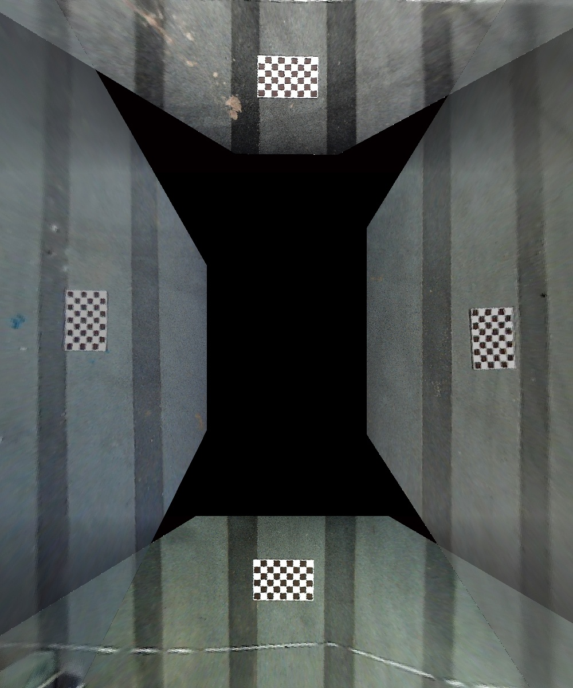
</p>

## Technical Route

The repository follows the four-stage technical route presented in the thesis defense:

```text
1. Fisheye camera calibration and distortion correction
   Zhang's checkerboard calibration
   → polynomial fisheye distortion model
   → undistorted camera images

2. Bird's-eye-view transformation and surround-view processing
   Perspective transformation
   → directional masking, stitching, and exposure compensation
   → vehicle-centered two-dimensional surround view

3. Transparent under-vehicle reconstruction
   Shi–Tomasi feature detection and pyramidal LK optical flow
   → inter-frame affine motion estimation
   → historical BEV alignment and region recovery
   → reconstructed road surface beneath the vehicle

4. Simulation validation and real-camera experiments
   CARLA environment and synchronized four-camera acquisition
   → online algorithm evaluation
   → real-camera dataset processing and result analysis
```

The first two stages are implemented in [`calibration/`](calibration/), the temporal reconstruction stage is implemented in [`opticalflow/`](opticalflow/), and the simulation branch is implemented in [`carla_simulation/`](carla_simulation/).

## Stage 1 — Fisheye Calibration and Distortion Correction

Four fisheye cameras provide front, rear, left, and right views. Intrinsic calibration estimates the camera matrix `K` and distortion coefficients `D`; the retained parameters are then used to generate undistorted views.

| Raw fisheye inputs | Undistorted views |
|---|---|
| 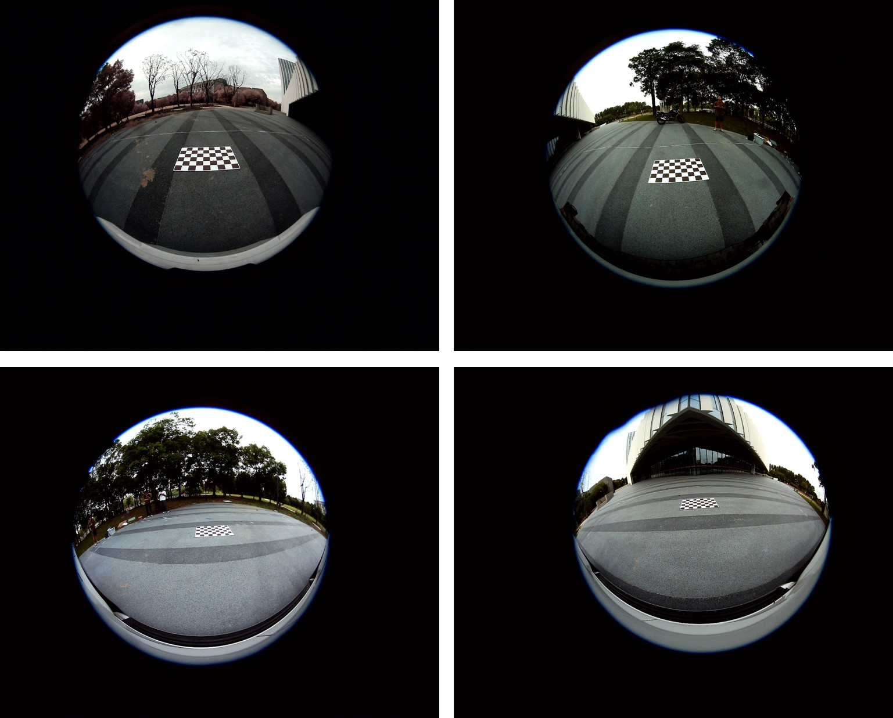 | 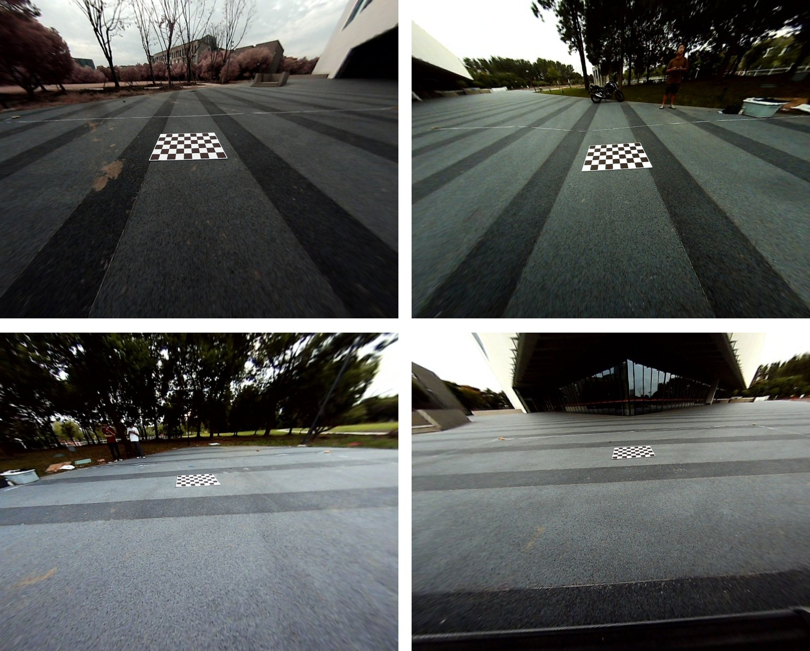 |

The module supports both pinhole and fisheye calibration models. The cleaned repository retains final NPY parameters together with human-readable OpenCV YAML copies.

## Stage 2 — BEV Transformation and Surround-View Stitching

Each undistorted image is projected into a shared ground-plane coordinate system with a homography `H`. Directional masks select valid regions from the four projected views. Adaptive exposure compensation reduces brightness differences, and distance-weighted feathering blends camera overlaps.

| Four projected BEV views | Exposure-compensated surround view |
|---|---|
| 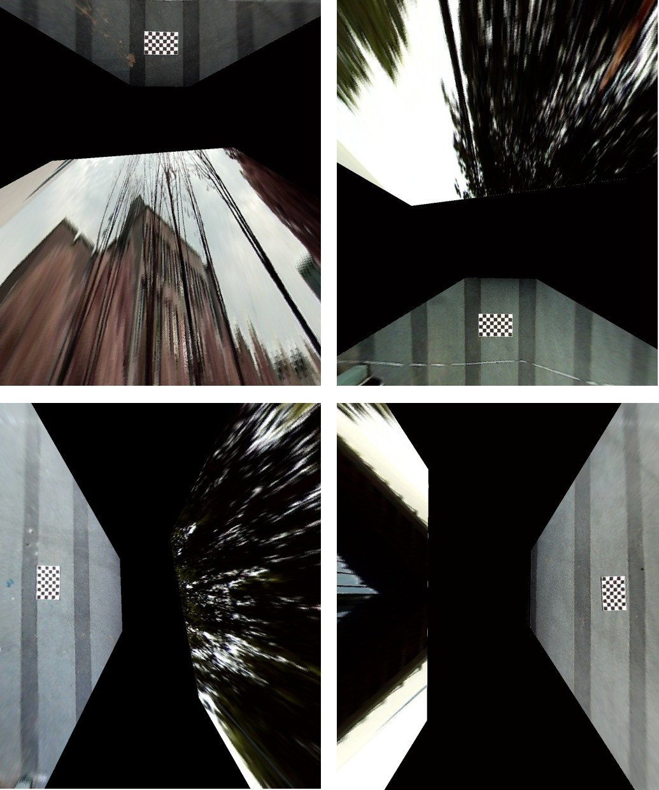 |  |

The black center region represents the area hidden by the vehicle and is the target of the temporal reconstruction stage.

## Stage 3 — Optical-Flow Transparent Under-Vehicle Reconstruction

The reconstruction module samples a BEV sequence, tracks Shi–Tomasi features with pyramidal Lucas–Kanade optical flow, estimates inter-frame motion, aligns historical road content, and fills the current missing region.

<p align="center">
  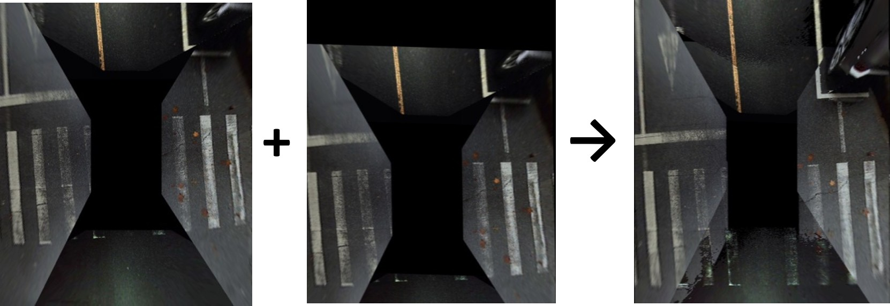
</p>

The following sequence illustrates recovered road content as the vehicle moves through the scene:

<p align="center">
  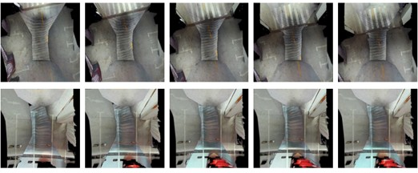
</p>

Motion is estimated from original sampled frames, while the previous recovered result carries road information forward through the sequence. Missing-region selection can use either a dark-pixel mask or a fixed center region.

## Stage 4 — CARLA Validation and Real-Camera Experiments

The CARLA branch creates a vehicle-mounted four-camera rig and collects synchronized views in a controllable environment. It reproduces the surround-view and temporal reconstruction pipeline without requiring access to the original vehicle platform.

| CARLA vehicle environment | Four camera views |
|---|---|
| 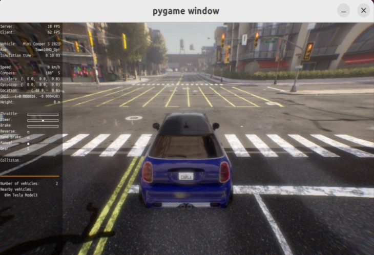 | 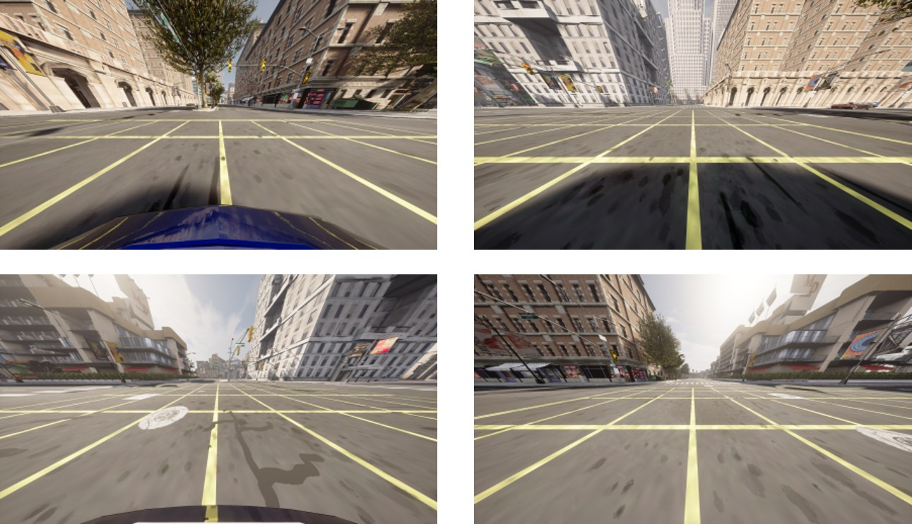 |

| Projected CARLA views | Stitched CARLA surround view |
|---|---|
| 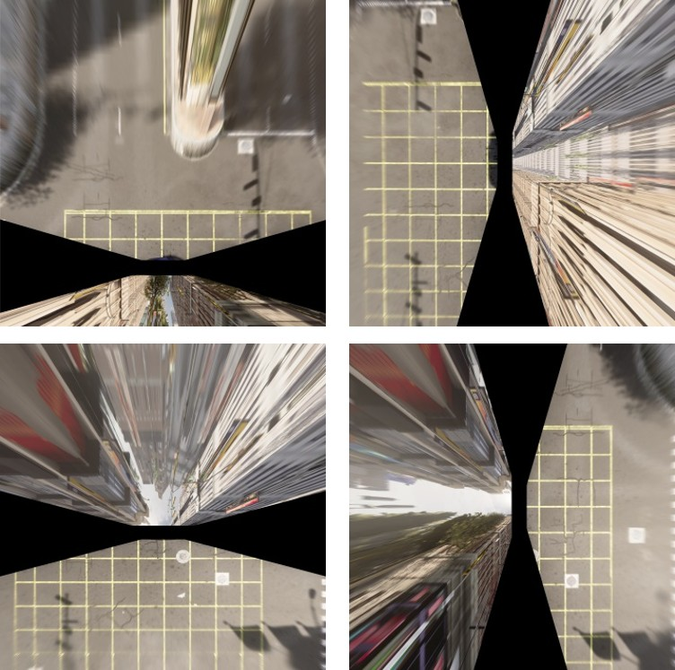 | 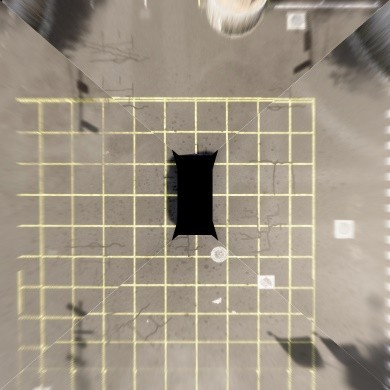 |

The transparent-view experiment accumulates inter-frame transformations and aligns historical BEV content with the current vehicle region:

<p align="center">
  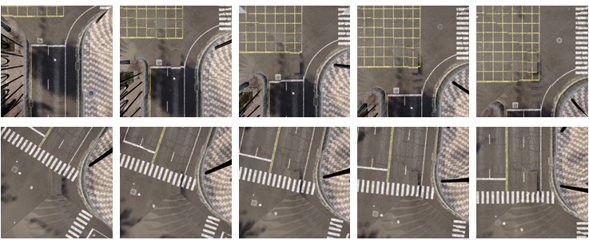
</p>

The real-vehicle experiment interface shows the four physical camera streams and the generated surround view running together on the original Ubuntu platform:

<p align="center">
  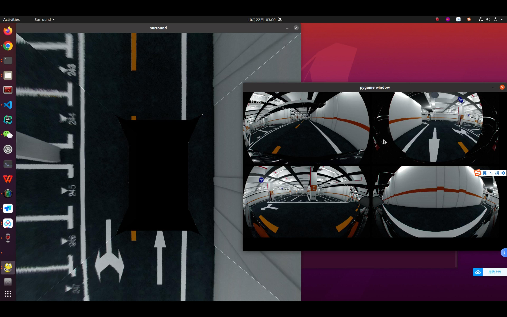
</p>

Real-camera experiments use the retained calibration parameters and sample fisheye images shown in Stages 1–3. The interface above is from the real-vehicle acquisition system, not CARLA. Large original datasets and generated frame sequences are excluded from Git.

## Repository Structure

```text
.
├── calibration/                    # Stages 1–2: calibration and stitching
├── opticalflow/                    # Stage 3: temporal BEV reconstruction
├── carla_simulation/               # Stage 4: simulation and online validation
├── requirements/
│   ├── base.txt                    # NumPy and OpenCV
│   └── carla.txt                   # Base dependencies and Pygame
├── assets/
│   └── images/                     # Selected presentation results
└── README.md
```

| Module | Main responsibilities | Documentation |
|---|---|---|
| Camera calibration | Estimate K, D, and H; undistort images; project BEV views; compensate exposure; blend and stitch | [Calibration documentation](calibration/README.md) |
| Optical-flow inpainting | Sample BEV frames; estimate motion; align history; recover dark or center regions | [Optical-flow documentation](opticalflow/README.md) |
| CARLA simulation | Create the camera rig; synchronize sensors; generate online standard and transparent BEV results | [CARLA documentation](carla_simulation/README.md) |

## Installation

Python 3.8 or later is recommended.

Install the calibration and optical-flow dependencies:

```bash
python -m pip install -r requirements/base.txt
```

Install the additional CARLA visualization dependency:

```bash
python -m pip install -r requirements/carla.txt
```

The CARLA Python API is not bundled with this repository. It must match the CARLA Server version and be importable as `carla` in the selected Python environment.

## Quick Start

Generate the real-camera surround view:

```bash
cd calibration
python generate_surround_view.py
```

Process a local BEV sequence with optical-flow inpainting:

```bash
cd opticalflow
python optical_flow_inpainting.py
```

Run the transparent-view simulation after starting CARLA Server:

```bash
cd carla_simulation
python -m carla_bev.run_transparent_view
```

Detailed parameters and additional commands are documented in each module README.

## Data and Reproducibility

- The calibration module retains final camera parameters and a compact real-camera example set.
- Optical-flow source sequences and generated outputs remain local and are excluded from Git.
- CARLA raw frames and generated output sequences are excluded from Git.
- The images under `assets/` are selected presentation results rather than runtime dependencies.
- CARLA and the original Ubuntu environment are not required to inspect the implementation.

## Limitations

- Calibration parameters are tied to the original cameras, mounting geometry, and image resolution.
- Temporal reconstruction assumes a mostly planar, static road surface.
- Dynamic objects and non-planar structures can introduce optical-flow errors.
- The CARLA path uses large-FOV RGB cameras aimed directly at the ground rather than a strict fisheye camera model.
- The real-camera and CARLA branches are related validation paths, not one fully automated cross-platform runtime.

## Project Background

This repository is a cleaned portfolio version of the undergraduate thesis *Research on Scene Reconstruction Technology for a Panoramic Parking Assistance System*. Historical experiments, corrupted source files, large datasets, and generated runtime media are intentionally excluded.

## Third-Party Notice

Part of the calibration implementation was derived from `dyfcalid/CameraCalibration`. See [THIRD_PARTY_NOTICES.md](calibration/THIRD_PARTY_NOTICES.md) before publishing or redistributing the complete repository.
